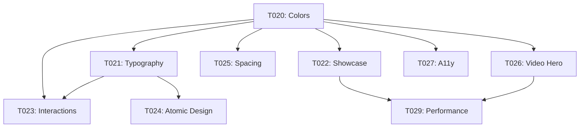

# Pórtico Premium Refactoring Roadmap

**Created:** 2026-02-03  
**Status:** Planning Complete, Ready for Execution  
**Total Effort:** ~30 hours estimated

---

## Executive Summary

Comprehensive audit revealed site positioned as **commodity service** (score 3.8/10 UI/UX) rather than luxury brand. Critical gaps: generic branding, informal messaging, no portfolio showcase, poor typography, excessive content density.

**Target transformation:** Commodity → Luxury Premium (score target: 8.5+/10)

---

## Critical Findings

### Marketing Positioning (4.5/10)
- Branding: "Pórtico" lacks exclusivity, color palette = e-commerce commodity
- Copy: Informal tone ("a gente"), feature-focused vs transformation storytelling
- Social proof: Zero awards/credentials/press mentions displayed
- Missing: Power words (bespoke, curated, signature, heritage)

### UI/UX Design (3.8/10)
- Typography: Generic fonts (Lexend Deca/Nunito Sans), disproportional scale jumps
- Spacing: Too dense (65% content vs luxury 50%), uniform section padding (no rhythm)
- Colors: Blue #2563a8 (corporate), Orange #ffa500 (urgency) - inappropriate for wealth
- Layout: No grid system, poor visual hierarchy, Gestalt violations
- Interactions: 98% absent, linear transitions (robotic), no scroll reveals
- Accessibility: WCAG violations (skip links missing, contrast 3.8:1 < 4.5:1 minimum)

### Development Quality (5/10)
- Components: Monolithic (68-81 lines), 80% code duplication in cards
- Performance: LCP estimated ~2.5s (target <1.2s), no image preloading
- Architecture: Lacks Atomic Design, weak component API (props design)

---

## Task Roadmap (30h Total)

### Priority 0: Critical (13h) - Week 1
Must complete for luxury positioning:

**T020: Premium Color System** (P1-S, 2h)
- Replace Orange/Blue → Navy/Gold/Charcoal
- Verify WCAG AA contrast (4.5:1+)
- Blocks: T021, T022, T023

**T021: Premium Typography** (P1-S, 2h)
- Fonts: Cormorant Garamond + Inter
- Type scale: Major Third (1.25 ratio)
- Line-heights: Display 1.1, Headline 1.3, Body 1.6

**T022: Project Showcase Component** (P1-M, 6h) ← MOST CRITICAL
- Before/after image gallery
- PhotoSwipe lightbox
- 4 AI-generated premium projects
- Position above fold (proof of luxury work)

**T023: Micro-interactions** (P1-S, 3h)
- Natural easing curves (no linear)
- Button press feedback (scale-95)
- Magnetic hover on CTAs
- Scroll-triggered reveals with stagger

### Priority 1: High Impact (12h) - Week 2
Essential for premium experience:

**T024: Atomic Design Refactor** (P2-M, 5h)
- Restructure: atoms/molecules/organisms
- Base Card component (eliminate duplication)
- Reduce codebase by ~120 lines

**T025: Spacing & Whitespace** (P2-S, 2h)
- 8px baseline grid
- Increase whitespace 35%→50%+
- Golden ratio section padding

**T026: Video Hero** (P2-M, 4h)
- 15s autoplay muted loop
- Vimeo/self-hosted MP4
- Mobile: poster only (bandwidth)

**T027: Accessibility WCAG AA** (P2-S, 3h)
- Skip links (Level A requirement)
- ARIA landmarks
- Keyboard navigation focus states
- Touch targets ≥48px

### Priority 2: Polish (7h) - Week 3
Final touches for excellence:

**T028: Copy Refactor** (P3, 3h)
- Formal voice ("nós" not "a gente")
- Transformation storytelling
- Power words integration
- Social proof section

**T029: Performance Optimization** (P3, 4h)
- LCP <1.2s (preload, srcset, LQIP)
- Font optimization (subset, preload)
- Critical CSS inlining
- Lighthouse 95+ target

---

## Execution Strategy

### Phase 1: Visual Foundation (Days 1-2)
```
T020 (Color) → T021 (Typography) → T023 (Interactions)
```
**Result:** Site looks premium immediately (colors, fonts, motion)

### Phase 2: Content Proof (Days 3-4)
```
T022 (Project Showcase) → T026 (Video Hero)
```
**Result:** Portfolio visible, cinematic hero established

### Phase 3: Architecture (Days 5-6)
```
T024 (Atomic Design) → T025 (Spacing) → T027 (A11y)
```
**Result:** Codebase clean, accessible, breathing space

### Phase 4: Refinement (Day 7)
```
T028 (Copy) → T029 (Performance)
```
**Result:** Messaging premium, Lighthouse 95+

---

## Success Metrics

**Before (Current):**
- UI/UX Score: 3.8/10
- Marketing: 4.5/10
- LCP: ~2.5s
- Accessibility: WCAG failures
- Whitespace ratio: 35%

**After (Target):**
- UI/UX Score: 8.5+/10
- Marketing: 8.5+/10
- LCP: <1.2s
- Accessibility: WCAG AA compliant
- Whitespace ratio: 50%+
- Lighthouse Performance: 95+

---

## Dependencies



**Critical Path:** T020 → T021 → T022 (10h minimum before visual impact)

---

## Risk Mitigation

1. **Risk:** Stakeholder rejects premium aesthetic
   - **Mitigation:** Create before/after comparison screenshots, A/B test

2. **Risk:** Typography too ornate (Cormorant)
   - **Mitigation:** Have Playfair Display as backup serif

3. **Risk:** Video hero performance issues
   - **Mitigation:** Aggressive compression, mobile poster-only

4. **Risk:** 30h estimate too aggressive
   - **Mitigation:** Prioritize P0/P1 tasks (25h), defer P2 if needed

---

## Approval Checkpoints

**After T020+T021 (4h):** Visual review of color/typography system  
**After T022 (10h):** Portfolio showcase approval  
**After T027 (23h):** Accessibility audit pass  
**After T029 (30h):** Final Lighthouse performance validation

---

## References

- Full Audit: Session 2 conversation (2026-02-03)
- Design Benchmarks: Bottega Veneta, Armani Casa, Architectural Digest
- Performance Targets: Core Web Vitals (LCP <1.2s, CLS <0.05)
- Accessibility: WCAG 2.1 Level AA
